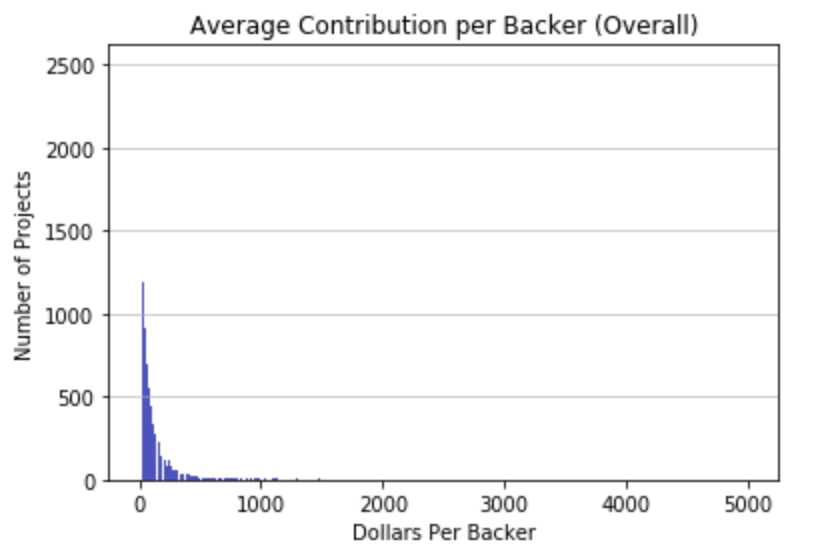
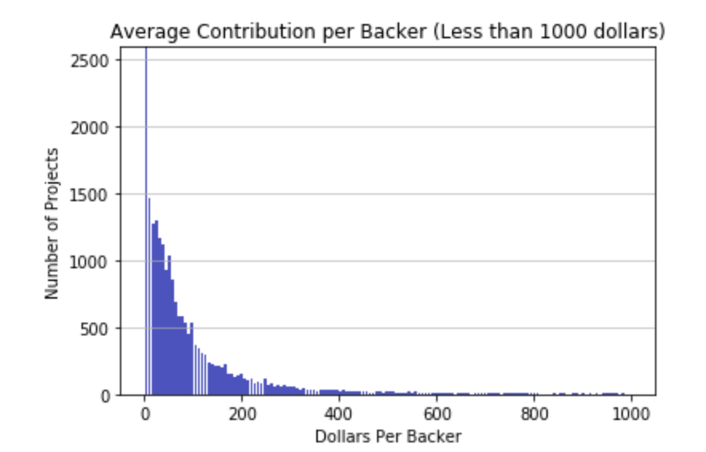
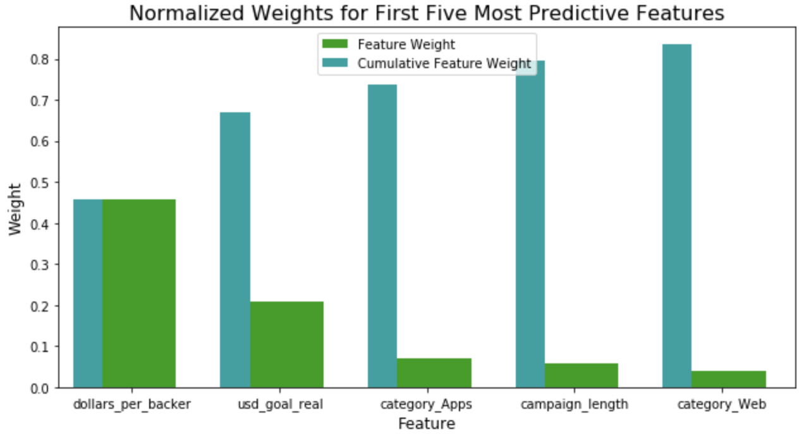

# Machine Learning Engineer Nanodegree
## Capstone Project
S. Umar Farooq
November 21st, 2018

## I. Definition

### Project Overview

Kickstarter is the largest crowdfunding platform in the world. More than fifteen million people have backed a Kickstarter campaign, with more than four billion dollars of funding being pledged since the site launched almost ten years ago. Some of the most successful projects have gained not just funding, but a large customer base and media coverage. Oculus, for instance, launched a campaign for its headset in 2012, raised 2.5 million dollars, and was acquired by Facebook for two billion dollars just three years later. 

### Problem Statement

There are several benefits to being an early backer of a major Kickstarter campaign. In addition to receiving perks, backers have the potential to become early investors in the product, which can have an enormous upside if the project is a technology project. Unfortunately, most projects on Kickstarter are [unlikely](https://www.statista.com/statistics/235405/kickstarter-project-funding-success-rate/) to meet their fundraising goal. This paper attempts to devise a model to calculate a project's likelihood of being successfully funded, and determine what features are the most important in a fundraising campaign's success.

This is a binary classification problem, where the dependent variable is whether or not the project was successfully funded. Many prominent Kickstarter projects have launched companies or become major acquisitions by industry leaders. Because many of these projects involve consumer technology, I will focus specifically on technology-related projects. I believe the likelihood of a project being successfully funded will depend largely on the size of the fundraising goal, with projects with smaller goals being more likely to meet their funding goals. I also believe projects with a longer campaign will be more likely to succeed. I believe the category of project will also be important (hardware, software, apps, etc.) but I do not know which categories might be the most likely to succeed.

After cleaning and transforming my data, I will analyze it using a logistic regression as a benchmark model. I will then attempt to improve on this classification using bagged and boosted decision trees, as well as a boosted random forest. After this, I will extract the most important features and explore the relationships they have with the outcome variable.

### Metrics

Logistic regression, random forests, and ensemble methods all have accuracy and F-score as possible evaluation methods. Using the testing results of these metrics, I can accurately compare each model to see which has the highest level of predictive power.

Determining beta as when evaluating each model's F-score is difficult. Changing beta weighs precision and recall differently. Either can be important depending on the target audience. If an investor is creating this model, they may prefer a model with a greater emphasis on precision, because an investor has a limited amount of money, and if they invest in projects they expect to succeed but don't actually succeed, it could be bad for their portfolio. For the average person, though, precision and recall might be weighted equally, since an average person does not have a strong preference between the two. Because my angle is somewhat more entrepreneurial, I will weigh precision more heavily and set beta to equal 0.5.

For determining which features are the most important, I intend to use the feature_importance metric available for the random forest classifier. I then intend to explore these features and their effect on the data.

## II. Analysis

### Data Exploration
My data set on available Kickstarter projects was obtained through Kaggle. In the full data set, there are 378,661 data points, though the number drops to 331,675 after the data set is limited to only projects with a successful or failed status (excluding projects which were canceled or are ongoing). That number decreasing even further once the data set is limited to technology projects, with the total number of observations dropping to 27,050.

The data set has both continuous and categorical features. Categorical features include the project's category (e.g. Hardware, Software, Apps), currency, and country where the campaign was launched. Continuous features include the fundraising target (goal), the amount of money pledged, the date the campaign was launched, the campaign deadline, and the number of backers. 

Below are summary statistics and the first few entries for the data after filtering out non-technology projects and projects whose outcome was neither successful nor failed.

#### Figure 1: Summary statistics for working data

|       | **backers**  | **usd_pledged_real** | **usd_goal_real** |
|-------|--------------|----------------------|-------------------|
| count | 27050.00000  | 2.705000e+04         | 2.705000e+04      |
| mean  | 186.14695    | 2.397673e+04         | 9.807654e+04      |
| std   | 1228.11862   | 1.359790e+05         | 1.591295e+06      |
| min   | 0.00000      | 0.000000e+00         | 7.500000e-01      |
| 25%   | 1.00000      | 1.100000e+01         | 5.009007e+03      |
| 50%   | 7.00000      | 3.600000e+02         | 1.800000e+04      |
| 75%   | 54.00000     | 5.515750e+03         | 5.000000e+04      |
| max   | 105857.00000 | 6.225355e+06         | 1.101698e+08      |

#### Figure 2: Assorted data points for working data
|     | **category** | **deadline** | **launched**        | **state** | **backers** | **country** | **usd\_pledged\_real** | **usd\_goal\_real** |
|-----|--------------|--------------|---------------------|-----------|-------------|-------------|------------------------|---------------------|
| 65  | Hardware     | 2015-07-03   | 2015-06-03 05:52:43 | failed    | 0           | CA          | 0.00                   | 39739.31            |
| 67  | Software     | 2017-07-02   | 2017-06-02 12:20:21 | failed    | 0           | GB          | 0.00                   | 2579.35             |
| 71  | Web          | 2016-08-23   | 2016-07-24 13:18:36 | failed    | 3           | US          | 141.00                 | 100000.00           |
| 98  | Gadgets      | 2015-03-07   | 2015-02-05 16:57:21 | failed    | 3           | CA          | 2.36                   | 19632.48            |
| 112 | Gadgets      | 2017-06-14   | 2017-05-10 16:00:18 | failed    | 6           | US          | 74.00                  | 500.00              |

A few points stand out from the summary statistics. First, the majority of projects have very few (less than 10) backers and receive less than $400 of funding. Second, the range of the continuous variables is immense. The number of backers range from 0 to 105,857, dollars pledged ranges from zero to more than 6 million, and goals range from 75 cents to 100 million dollars. Some work will be needed to deal with these outliers. Lastly, though it is not apparent from these figures, the data set does not require extensive cleaning. There do not appear to be instances of or incomplete data for either the categorical or continuous variables. 

### Exploratory Visualization

As mentioned, one of the challenges of this data set is the range of values for the continuous features. This is illustrated with the below two graphs, which plot the average contribution of backers. Note: this is a generated feature, not one that comes as part of the original data set. Additional details on how and why this feature was generated are available in the Data Preprocessing section of this report.

#### Figure 3: Average contribution to projects

In the above figure, it is clear the majority of individuals are investing less than 500 dollars apiece, but it is difficult to gain additional information because the range of the data inhibits the visualization. Strategies for dealing with this range are detailed in the Data Preprocessing section.

#### Figure 4: Contributions 

When the data is viewed with a more limited range, it becomes easier to determine that the largest number of projects have relatively small average contributions, maybe less than 20 dollars. Moreover, it becomes clearer that the number of projects with a high average contribution rate falls around the 50 dollar mark. 

### Algorithms and Techniques

As mentioned before, I will use bagged and boosted decision trees, boosted and unboosted random forests, and logistic regression to determine which algorithm has the highest predictive power in determining the relevant features in predicting campaign success.

The reasons for choosing these algorithms is relatively straightforward. Using ensemble methods allows us to reduce the likelihood of overfitting and reduce the variance in the model by training several weak learners. The reason for using both random forests and bagged trees is because random forests only use a subset of the features to train the weak learners. I was unsure if only training on a subset of features might leave out important data or if it would reduce unnecessary noise, so I used both versions.

Each model has a range of hyperparameters that can be picked. I will use sklearn's GridSearchCV tool to pick most of the optimal hyperparameters for each model. I will prioritize hyperparameters which I think will have a noticeable impact on how the model performs (e.g., the minimum number/percentage of samples that need to be in the leaf of a decision tree or random forest.) I will also exclude parameters which I do not think make sense to evaluate using GridSearchCV. For instance, AdaBoost takes in a parameter for the number of estimators, and it is expected that a larger number of estimators will consistently yield better estimates.

### Benchmark

The benchmark model I will use to compare against my random forest and ensemble methods is a logistic regression. This is because logistic regression is considered to be a good starting point for most binary classification problems. It is quick to train, has high predictive capability, and is relatively robust for several use cases. As mentioned above, I will use GridSearchCV to also optimize the hyperparameters for the logistic regression model so I can fairly compare it with the models I am testing out.

As for setting a default F-score or accuracy measurement as the standard, I do not have a prior distribution or probability I can use to determine how much variance our model should account for. My hope is that the models can achieve higher than 50% accuracy, but this is not sufficient reason to set this as our benchmark.

## III. Methodology

### Data Preprocessing

I began by dropping unnecessary variables, such as the IDs, names, and currency of funds raised of each Kickstarter project. I also dropped variables containing each project's goal or amount pledged and opted to instead use the amount of money in real US dollars for consistency between projects in different countries.

Next, I used Python's datetime library to generate a feature for the length of each fundraising campaign using the date launched and deadline for each campaign. Summary statistics for that variable, named "campaign_length" are below.

#### Figure 5: Summary statistics for campaign length

|       | **campaign\_length** |
|-------|----------------------|
| count | 27050.000000         |
| mean  | 35.264288            |
| std   | 11.771582            |
| min   | 1.000000             |
| 25%   | 30.000000            |
| 50%   | 30.000000            |
| 75%   | 40.000000            |
| max   | 92.000               |

The data had three continuous variables that all seemed indicative of success: the campaign's fundraising goal, the amount of funds pledged, and the number of backers. I expected the funds pledged and the number of backers to be positively correlated with success but felt uncertain about leaving both the funds pledged and the goal in as features. Using both of them would allow an individual to predict every data point. Yet it also seemed excessive to drop either variable; each contained potentially valuable explanatory data. To get around this, I created a variable for the dollars raised per backer, by dividing the amount pledged by the number of backers. This allowed me to retain the data contained within the features without risking exposing too much information. I then removed both of the original variables, leaving me with features for the average pledge per backer and the goal of each fundraising campaign. With a feature for average pledge per backer, I might also be able to understand if a project's success was driven by several small dollar donations or by relatively large and wealthy investors. Summary statistics for the generated variable are below.

#### Figure 6: Summary statistics for the average contribution per backer

|       | **dollars\_per\_backer** |
|-------|--------------------------|
| count | 21158                    |
| mean  | 109.956006               |
| std   | 209.61163                |
| min   | 0.49                     |
| 25%   | 20.548905                |
| 50%   | 52.473046                |
| 75%   | 116.676603               |
| max   | 5000.5                   |

An observant reader might notice that creating the above variable could be problematic, as there were several instances where projects had no backers. On the advice of mentors, I opted to drop instances where campaigns had zero backers. Additional commentary on this decision is available in the Improvement section of this report.

The next major hurdle was to deal with outliers in my data. This was most problematic in the feature for each campaign's fundraising goal. With some campaigns having goals as high as 100 million dollars, the variation in this feature could dramatically skew the distribution of the data. I saw that approximately 10% of my observations had goals over 200,000 dollars, but more than of those observations had less than ten backers, suggesting that the campaigns were outlandish in their goals. This is substantiated when examining [some](https://www.kickstarter.com/projects/2099347793/hydroponics-skyscraperun-gratte-ciel-hydroponiquee?ref=discovery&term=hydroponics) of the projects with the largest goals on Kickstarter. Since my capstone is focused on serious projects, campaigns with very outlandish goals arguably fall outside of the scope of my research, but they can also obfuscate the patterns in the data I am interested in. I removed the roughly five percent of observations with goals above 200,000 dollars, and removed any observations with goals above 100,000 dollars with less than ten backers.

This step addressed a large amount of the variance in one of my features, but not the rest of them. To address the variance more generally, I then log transformed and scaled the data.

### Implementation
In this section, the process for which metrics, algorithms, and techniques that you implemented for the given data will need to be clearly documented. It should be abundantly clear how the implementation was carried out, and discussion should be made regarding any complications that occurred during this process. Questions to ask yourself when writing this section:

Implementing these algorithms has a few main steps
1. Getting initial measurement statistics on the benchmark and comparison models using unoptimized hyperparameters
2. Creating a list of optimized hyperparameters using GridSearchCV and comparing the optimized models against one another
3. Determining what the most important features are by plotting the feature relevance
4. Determining the sign/direction of the parameters, e.g. determining if having a larger campaign goal increased or decreased the likelihood of having a campaign successfully funded.

### Refinement

Optimizing the hyperparameters for random forests and logistic regression is relatively straightforward using GridSearhCV, but boosted random forests and bagged and boosted decision trees are a bit tougher, as both the base estimator and the ensemble method have hyperparameters that need to be optimized. I opted to first optimize the base estimator and then optimize the parent estimator afterward.

## IV. Results

### Model Evaluation and Validation

I began by comparing unoptimized logistic regression, bagged and boosted trees, and boosted and unboosted random forests to compare their performance. I compared the results across various training set sizes, but gleaned the most information from when I used my whole training set. Doing so, Logistic regression performed the best, predicting the testing data with 77.19% accuracy and with an F-score of 0.60. Bagged decision trees, boosted random forests, and boosted random forests were the next best algorithms in terms of both accuracy and F-score. Notably, the accuracy and F-score of all models except the logistic regression model reached or approached 1, indicating strong overfitting. I found this surprising, given the ensemble methods typically aim to reduce complexity and overfitting present in ordinary decision trees. Still, the presence of overfitting meant I would need to be careful when improving my models.

I then began tuning the hyperparameters of each model. Using GridSearchCV, I found that each model had various hyperparameters which needed tuning. The final hyperparameters are given below.

#### Figure 7: Tuned hyperparameters by model

| **Model Name**        | **C** | **Penalty** | **Min\_samples\_split** | **min\_samples\_leaf** | **learning\_rate**     | **max\_samples**       | **max\_features**      |
|-----------------------|-------|-------------|-------------------------|------------------------|------------------------|------------------------|------------------------|
| Decision Tree         | N/A   | N/A         | 0.01                    | 0.0005                 | N/A                    | None                   | None                   |
| Logistic Regression   | 9     | l1          | N/A                     | N/A                    | N/A                    | N/A                    | N/A                    |
| Random Forest         | N/A   | N/A         | 0.005                   | 0.0001                 | N/A                    | None                   | auto'                  |
| Boosted Random Forest | N/A   | N/A         | Same as base estimator  | Same as base estimator | 0.05                   | Same as base estimator | Same as base estimator |
| Boosted Decision Tree | N/A   | N/A         | Same as base estimator  | Same as base estimator | 0.05                   | Same as base estimator | Same as base estimator |
| Bagged Decision tree  | N/A   | N/A         | Same as base estimator  | Same as base estimator | Same as base estimator | 0.6                    | 0.8                    |

I then examined the feature relevance of the different variables by looking at both the random forest feature predictions and the benchmark model feature predictions. Both models suggested dollars per backer was the strongest predictor of Kickstarter campaign success, followed by the campaign's goal. The random forest model suggests nearly 70% of the predictive power of the model lies in these two features alone. From there, the models diverge on the importance of the features. The benchmark model suggests the next strongest predictors of success are if the project was launched in Japan or Belgium, followed by if the campaign was categorized as a web or app project. The random forest model suggests the next strongest predictors are if the project was an app, the length of the campaign, and then if the project's category was "Web".

For evaluating each feature's relevance, the coefficients on the logistic regression suggest that dollars per backer is strongly positively associated with the chance of success, with projects with smaller goals and those originating in in Japan also being more likely to succeed. Projects originating in Belgium, as well as those classified as "Web" or "Apps" projects are negatively associated with the chance of success.

### Justification

After tuning the hyperparameters, all of the chosen models performed better than their initial, untuned iteration. Moreover, the models performed near or better than the benchmark logistic regression model. The logistic regression model did not improve much from initial, unoptimized test, predicting the testing data with 77.32% accuracy with an F-score of 0.6039. The boosted decision tree performed slightly worse in terms of accuracy, predicting 77.27% of the data correctly, but with slightly better F-score of 0.6054. Bagged decision trees performed slightly worse than the benchmark, predicting the testing data with 76.70% accuracy with an F-score of 0.5831. Random forests performed slightly better than the benchmark, predicting the testing data with 77.55% accuracy with an F-score of 0.6084.

Additionally, all models performed well on the training set and testing sets after the hyperparameters were tuned, suggesting that the extreme overfitting which occurred before tuning was eliminated. Both the improvement in the performance of the models on the testing set and the apparent reduction in overfitting on the training data suggest the models have been trained robustly.

## V. Conclusion

### Free-Form Visualization

#### Figure 8: Most Predictive Features (Random Forest)

The above graph shows the five features with the most predictive power in determining a project's success. These five features appear to hold 80% of the predictive power of our model.

### Reflection

This had two parts. First, to determine what model best predicted the likelihood of success for Kickstarter campaigns meeting their fundraising goals. Second, to determine what features increased or decreased the likelihood of success. To achieve these goals, I underwent the following steps

1. Remove all non-Technology projects from the data set, as well as any unnecessary variables
2. Generate new variables for the length of the campaign and the average contribution per backer for each project
3. Remove extreme outliers, meaning instances which dramatically increase the variance in the data set
4. Log-transform and scale the data to attempt to normalize the data
5. Test performance of the untuned models
6. Using GridSearchCV, determine the correct hyperparameters for the benchmark model as well as the ensemble models and their base estimators
7. Retest the predictive power of the tuned models, comparing them with the initial observations and the benchmark.
8. Using any of the tuned models, determine what features were important and how these features were associated with the outcome variable

The most difficult and interesting aspect of the project was dealing with the outliers, in that it forced me to examine how robust various models are for dealing with outliers and understand what techniques are used to reduce variance while minimizing information loss.

### Improvement

Arguably the largest challenge of this project was dealing with the degree of variance in the data's continuous variables. In some instances, data was dropped as an outlier because it fell outside the scope of this project. Additional research could attempt different ways to reduce variance in the data while minimizing information loss. For instance, instead of dropping observations, observations could be winsorized or binned. Alternatively, the data could be divided into subsets, or a new categorical variables could be created to classify each observation (e.g. small_goal, medium_goal, and large_goal, based on the size of each project's funding goal.) Additional analyses could be conducted on these subgroups within the data, seeing if patterns emerge within them.

Additionally, the manner in which I optimized the hyperparameters for ensemble models using GridSearchCV could be improved. My approach was to first optimize the base estimator and then optimize the ensemble method. There may be to test all combinations of both the base estimator and the ensemble method, similar to a nested for loop. Doing so might yield slightly different results.

Finally, additional work could be done to improve each feature's importance. I was able to extract feature relevance scores from the benchmark model and the unboosted random forest model, but I could only determine if the features were positively or negatively associated with the outcome variable through the former model. Additional work could be done to see how the ensemble methods gauged feature importance or the association of each feature with the outcome variable